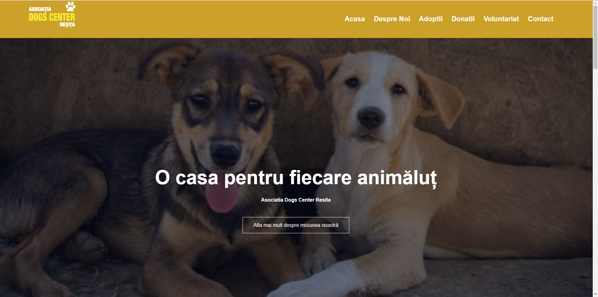
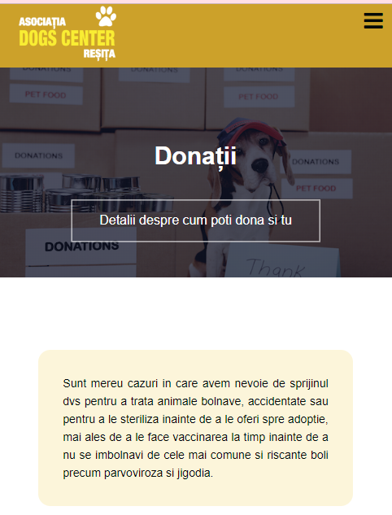
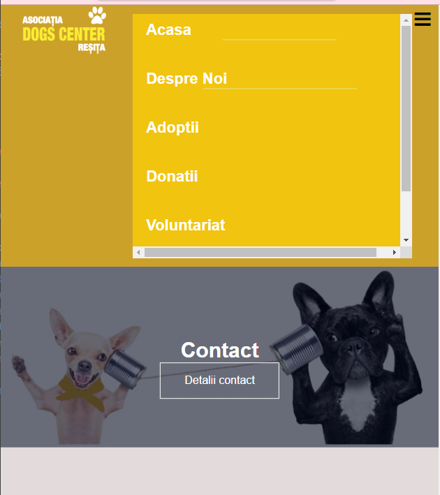

# ONG Website

## Description

This repository contains the source code for a responsive ONG (Non-Governmental Organization) website, built using HTML and CSS. The website is a recreated and improved version of the existing page found at [Dogs Center](https://dogscenter.ro/ro/acasa/). My version enhances the original design, making it more organized and user-friendly while retaining the core information and functionality.

## Table of Contents

- [Features](#features)

- [Photos](#photos)

## Features

- **Responsive Design**: Adapts to mobile and desktop views.
- **Header with Navigation**: Includes logo and navigation links with a responsive menu.
- **Mission Section**: Details the organization's mission.
- **Gallery Section**: Displays images related to the organization.
- **Contact Form**: Allows users to get in touch.
- **Donation and Adoption Sections**: Information on how to support the organization.
- **Volunteer Section**: Details on how to get involved.
- **Enhanced and Organized Layout**: Improved structure and aesthetics compared to the original Dogs Center page.

## Photos

This project involves the recreation and enhancement of the website for a local dog rescue center. The original website can be found at [DogsCenter](https://dogscenter.ro/ro/acasa/). The purpose of this recreation is to showcase how a well-organized and structured webpage can significantly improve the visibility and effectiveness of a nonprofit organization.

### Improvements Made

- **Streamlined Design:** Redesigned for better organization and clarity, ensuring that the essential messages and calls to action are prominent and easy to navigate.
- **Enhanced User Experience:** Improved the layout to facilitate easier access to information about the center’s mission, programs, and ways to get involved.
- **Modern Aesthetics:** Applied contemporary design elements to make the website more visually appealing and engaging.
- **Responsive Layout:** Ensured the site adapts seamlessly to various devices, providing a consistent experience across desktops, tablets, and smartphones.

### How This Helps

A well-structured and organized website can make a substantial difference for a nonprofit organization by:
- **Increasing Visibility:** A clear and attractive design helps in catching the attention of potential supporters and donors.
- **Communicating Effectively:** Proper organization and layout make it easier for visitors to understand the organization's mission and how they can contribute.
- **Enhancing Accessibility:** A responsive design ensures that all users, regardless of their device, can access and engage with the site’s content.

